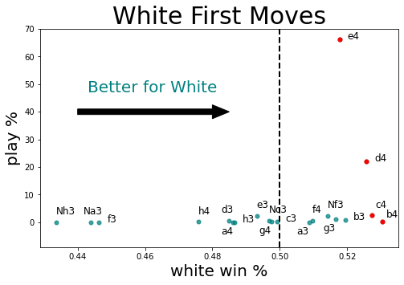
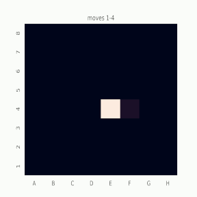
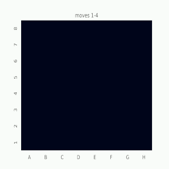

# hacking-chess-for-beginners
The player base for online chess has exploded over the last 10 years, due to the rise of free to play chess websites that allow you to play with players from around the world ----

Chess is well known for being one of the most strategically difficult and complex games.  Even the opening few moves of a chess game, which might seem relatively limited at first glance, demonstrates how astronomically diverse the game is.  By the time both players have taken 3 turns each (each pair of turns is referred to as one move), the number of possible board states is around 120 million.  This dense thicket of possibilties can be an incredibly daunting for new players and as such beginners (like myself!) tend to stick to just one or two openings.  Yet, learning specific chess openings can be incredibly important to improving and is one of the first things that beginners are instructed to learn after learning the basics.  However, advice on what openings to learn is often coming from the perspective of teachers and more experienced players.  I wanted to know what are the openings for beginner level players that statistically lead to the highest win percentage both from black and white side.  Are there openings that would lead to significantly higher winrates for these players?

## Data
The data for this project came from the public database from lichess.org, a popular free online chess site.  I collected all of the game data January 2021, which consisted of almost 100 million games.  For the majority of my analysis I filtered this data by elo rating (a score that approximates a players skill relative to the rest of the playerbase), looking specifically at the 1000-1500 elo range, which is generally considered the range between beginner and intermediate, where learning openings starts to become important.  For comparison, the 0-1000 elo range typically encompasses players that are learning the fundementals of chess while the highest rated chess grandmasters can be rated well above 3000 elo.  The 1000-1500 elo range encompasses nearly half of the playerbase and is a where a lot of chess learners get "stuck" (like me!)

graph of playerbase -----

Additionally, selected only games played in the 5 minute time format as it is one of the most popular and is long enough for opening selection to have a large effect on the game.  

Analysis
three breakdowns
first move

  

 

  

 

  

  

 

 

  

  

named openings
how many to look at?
first three moves w
first three moves b

castling?
compare to higher rated players
over different brackets
