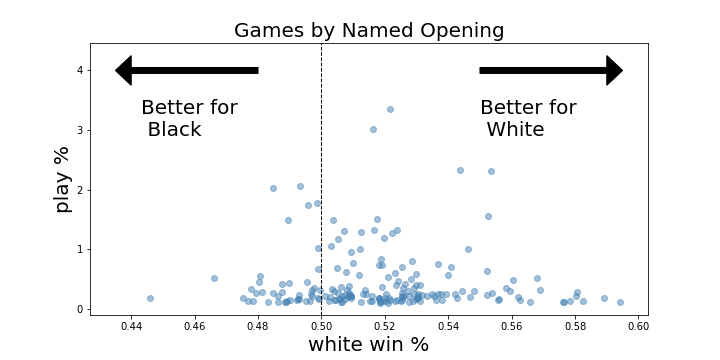

# hacking-chess-for-beginners
The player base for online chess has exploded over the last 10 years, due to the rise of free to play chess websites that allow you to play with players from around the world ----

Chess is well known for being one of the most strategically difficult and complex games.  Even the opening few moves of a chess game, which might seem relatively limited at first glance, demonstrates how astronomically diverse the game is.  By the time both players have taken 3 turns each (each pair of turns is referred to as one move), the number of possible board states is around 120 million.  This dense thicket of possibilties can be an incredibly daunting for new players and as such beginners (like myself!) tend to stick to just one or two openings.  Yet, learning specific chess openings can be incredibly important to improving and is one of the first things that beginners are instructed to learn after learning the basics.  However, advice on what openings to learn is often coming from the perspective of teachers and more experienced players.  I wanted to know what are the openings for beginner level players that statistically lead to the highest win percentage both from black and white side.  Are there openings that would lead to significantly higher winrates for these players?

# Data
The data for this project came from the public database from lichess.org, a popular free online chess site.  I collected all of the game data January 2021, which consisted of almost 100 million games.  For the majority of my analysis I filtered this data by elo rating (a score that approximates a players skill relative to the rest of the playerbase), looking specifically at the 1000-1500 elo range, which is generally considered the range between beginner and intermediate, where learning openings starts to become important.  For comparison, the 0-1000 elo range typically encompasses players that are learning the fundementals of chess while the highest rated chess grandmasters can be rated well above 3000 elo.  The 1000-1500 elo range encompasses nearly half of the playerbase and is a where a lot of chess learners get "stuck" (like me!)

Additionally, selected only games played in the 5 minute time format as it is one of the most popular and is long enough for opening selection to have a large effect on the game.  This narrowed the pool of games from 100 million to 4 million, which is more than enough to be able to compare the effectiveness of different openings  

# Analysis

## Named Openings
Traditionally, chess openings are categorized by their name.  These are names such as the Queen's Gambit, the Sicilian, the Ruy Lopez, and my personal favorite, the Fried Liver Attack (yes that's a real name of a chess opening).  Every point on the plot below represents a distinct named opening (yes there are a ton of them!), showing how often it is played on the y axis and the win percent from white's perspective on the x axis.  Openings to the right of 0.5 lead to a higher chance of white winning while the left represent openings that favor black.    

We can clearly see that Chess systematically advantages white because the player gets to make the first move.  This advantage is estimated to be worth around a half a pawn.  There are a few issues with evaluating chess openings based on their name. Named opening are of variable length, some only consist of 1 move for white while others can be up to eight individual moves in total.  Secondly, several named openings are just variations of another distinct opening with the same name (i.e. the Queen's Gambit vs. the Queen's Gambit Declined).  These factors make the name a difficult parameter to analyze the dataset by.  Let's try something simpler instead.

## First Moves
First we can analyze the opening moves for white, again plotting them by win percentage and frequency played.  
  

The move pawn to e4 is by far the most popular move to begin the game with for white.  It serves two purposes, to grab hold of the center of the board (which is seen as advantageous) and it allows both the queen and the light-square bishop to enter the game if needed.  However, the moves pawn to b4, c4, and d4 all have a marginally higher win percentages for white.  Notably, all these opening moves are accomplishing the same thing, to leap into the center of the board and try to limit what squares black can manuever their pieces to.  If you are beginner who always starts with e4, these other centralizing pawn moves may be worth investigating.   

Black's first move shows a bit more diversity, which may reflect the fact that it can be influenced by what move white played.  
 

Unfortunately, the outlook is pretty bleak for black; only one move barely has a positive winrate and there aren't many great alternatives.  Unlike white's opening move, black's most common and advantageous first moves refelct a diversity of approaches.  Pawn to g6 is a relatively timid move, looking to hide the king beneath a pawn hut by castling quickly.  Pawn to e5 and c5 are moves that are trying to fight white for control of the center of the board.  Pawn to d5 is an odd move, inviting white to immediately take your pawn.  While chess engines do not approve of this approach, this opening has been played by the top rate players.  Part of it's popularity here comes from a trick of online chess.  Chess sites have a feature that allows you to premove your next move so that it will happen as soon as the other player takes their turn. Many players simply auto pilot pawn to e4 followed by premoving knight to f3, which now allows black to take their pawn and threaten the knight on f3!  However, these sorts of tactics become less and less effective as you move up through ratings. 

## First Three Moves for White
Looking at the first move for white and black gave a few possible advantageous option to start the early game.  

![]first_three_moves_white.png

![]white_gambit_openings_across_elo.png

![]white_gambit_openings_2000elo_plus.png

## What makes these openings so successful?

| White  | Black |
| :-------------: | :-------------: |
|          Pawns     |       Pawns        |
| |  |
|          Knights     |       Knights        |
| |  |
|          bishops     |       bishops       |
| |  |
|          queen    |       queen       |
| |  |
|          rooks     |       rooks       |
| |  |
|         kings    |      kings       |
| |  |

