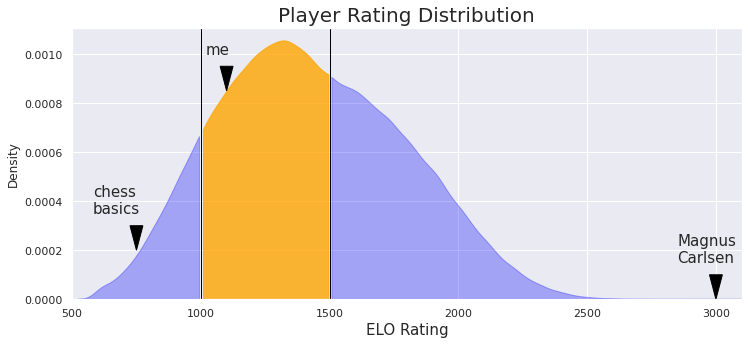
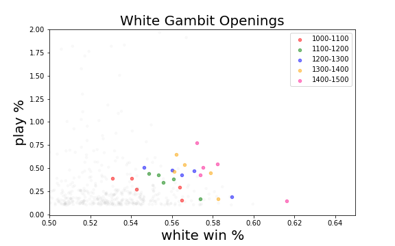

# Hacking Chess for Beginners
The player base for online chess has exploded over the last 10 years, due in part to the rise of free to play chess websites that allow you to play with players from around the world.  The world of chess is expanding in some of the most interesting and unexpected ways with new stylistic metagames amongst chess professionals, new chess variants, and the rise of undefeatable chess AI.  If you are new to chess, this project may have some useful insights to help boost you rating!  Read to the end to figure out what these shapeshifting cubes are!

  

Chess is well known for being one of the most strategically difficult and complex games.  Even the opening few moves of a chess game, which might seem relatively limited at first glance, demonstrates how astronomically diverse the game is.  By the time both players have taken 3 turns each (each pair of turns is referred to as one move), the number of possible board states is around 120 million.  This dense thicket of possibilties can be an incredibly daunting for new players and as such beginners (like myself!) tend to stick to just one or two openings.  Yet, learning specific chess openings can be incredibly important to improving and is one of the first things that beginners are instructed to learn after learning the basics.  However, advice on what openings to learn is often coming from the perspective of teachers and more experienced players.  I wanted to know what are the openings for beginner level players that statistically lead to the highest win percentage both from black and white side.  Are there openings that would lead to significantly higher winrates for these players?

# Data
The data for this project came from the public database from lichess.org, a popular free online chess site.  I collected all of the game data January 2021, which consisted of almost 100 million games.  For the majority of my analysis I filtered this data by elo rating (a score that approximates a players skill relative to the rest of the playerbase), looking specifically at the 1000-1500 elo range, which is generally considered the range between beginner and intermediate, where learning openings starts to become important.  For comparison, the 0-1000 elo range typically encompasses players that are learning the fundementals of chess while the highest rated chess grandmasters can be rated well above 3000 elo.  The 1000-1500 elo range encompasses nearly half of the playerbase and is a where a lot of chess learners get "stuck" (like me!)

Additionally, selected only games played in the 5 minute time format as it is one of the most popular and is long enough for opening selection to have a large effect on the game.  This narrowed the pool of games from 100 million to 4 million, which is more than enough to be able to compare the effectiveness of different openings.  Lastly, while grouping the data, openings that had < 0.1% occurance rate were excluded as they were found to be mostly nonsensical and disadvantageous move sets.

# Analysis

## Named Openings
Traditionally, chess openings are categorized by their name.  These are names such as the Queen's Gambit, the Sicilian, the Ruy Lopez, and my personal favorite, the Fried Liver Attack (yes that's a real name of a chess opening).  Every point on the plot below represents a distinct named opening (yes there are a ton of them!), showing how often it is played on the y axis and the win percent from white's perspective on the x axis.  Openings to the right of 0.5 lead to a higher chance of white winning while the left represent openings that favor black.    

We can clearly see that Chess systematically advantages white because the player gets to make the first move.  This advantage is estimated to be worth around a half a pawn.  There are a few issues with evaluating chess openings based on their name. Named opening are of variable length, some only consist of 1 move for white while others can be up to eight individual moves in total.  Secondly, several named openings are just variations of another distinct opening with the same name (i.e. the Queen's Gambit vs. the Queen's Gambit Declined).  These factors make the name a difficult parameter to analyze the dataset by.  Let's try something simpler instead.

## First Moves
First we can analyze the opening moves for white, again plotting them by win percentage and frequency played.  
  

The move pawn to e4 is by far the most popular move to begin the game with for white.  It serves two purposes, to grab hold of the center of the board (which is seen as advantageous) and it allows both the queen and the light-square bishop to enter the game if needed.  However, the moves pawn to b4, c4, and d4 all have a marginally higher win percentages for white.  Notably, all these opening moves are accomplishing the same thing, to leap into the center of the board and try to limit what squares black can manuever their pieces to.  If you are beginner who always starts with e4, these other centralizing pawn moves may be worth investigating.   

Black's first move shows a bit more diversity, which may reflect the fact that it can be influenced by what move white played.  
  

Unfortunately, the outlook is pretty bleak for black; only one move barely has a positive winrate and there aren't many great alternatives.  Unlike white's opening move, black's most common and advantageous first moves refelct a diversity of approaches.  Pawn to g6 is a relatively timid move, looking to hide the king beneath a pawn hut by castling quickly.  Pawn to e5 and c5 are moves that are trying to fight white for control of the center of the board.  Pawn to d5 is an odd move, inviting white to immediately take your pawn.  While chess engines do not approve of this approach, this opening has been played by the top rate players.  Part of it's popularity here comes from a trick of online chess.  Chess sites have a feature that allows you to premove your next move so that it will happen as soon as the other player takes their turn. Many players simply auto pilot pawn to e4 followed by premoving knight to f3, which now allows black to take their pawn and threaten the knight on f3!  However, these sorts of tactics become less and less effective as you move up through ratings. 

## First Three Moves for White
If the first move for each side signifies how players want to approach an empty starting board, the first three moves lays out the strategy that each player wants to enter the mid-game with.  From White's perspective, we can see that there a several options that lead to suprisingly high winrates for white.  Closer inspection of some the top performers reveals them to be impractical openings, i.e. one's that require black to play strategically poor moves.  These openings are not useful because they are relatively rare and not easily accessible from white's perspective.  However, several of the best opening three moves for white are movesets that could be practically played.  Interestingly, they all had one thing in common: they were all gambit openings.  
|                 |               |
| :-------------: | :-------------: |
|                 |        Vienna Gambit         |
| |  |
|         Queen's Gambit        |        King's Gambit         |
| |  |

A gambit (such as the queen's gambit) is an opening where a player sacrifices one or more pieces (usually pawns) in order to get a positional advantage, e.g. by allowing white to develop their major pieces onto the board.  There were three main types of gambits (and their variants) that appeared in the top ten openings for white: 1) the Vienna Gambit, the King's Gambit, and the Queen's Gambit.  The Vienna Gambit and the King's Gambit are considered very aggresive, seeking to sacrifice their f pawn, which is usually considered a crucial defender of the white king. The Queen's gambit is considered a more positional opening, attempting to sacrifice white's c pawn in order to lure one of black's central pawn away from the center.    

While the Queen's gambit is considered a mainstay of chess openings and is frequently played at the highest levels, the Vienna Gambit and King's Gambit are generally considered technically unsound.  As such, I wanted to see if these particular openings would be less succesfful as higher elo ratings, where players might know how to better defend against the aggression.  To my surprise, these gambit openings actually perform better as you move up from 1000-1500 elo.  

I was surprised by this result, but it can be rationalized by the fact that these gambit openings require your to accomplish something with your positional advantage, otherwise you will have lost a pawn for nothing.  It is plausible that the closer to 1500 elo, the more players understand how to succesfully launch an attack on the opposing side.  Still, these openings would be a great choice for beginners to invest in, as they perform well even at 1000 elo and will continue to be effective against players as you gain rating.  I was also to curious to see how these gambit perform at the elite tier of chess players (elo > 2000):

Not bad!  These are openings you keep in your back pocket for your whole chess career.  Before we move on, we should talk about things from black's perspectives.  Where there openings that similarly led to higher win chances for black?  Unfortunately, a similar analysis produced some openings that had above 50% winrate for black, but once again, these were openings where white played erroneously.  Part of the imbalance of chess is that white generally directs the flow of the opening, leaving people playing with the black pieces to create positional advantages in the midgame in order to win games.  More work is necessary to find out what strategies are optimal for the black pieces.  

## What makes these openings so successful?
Lastly I wanted to get an understanding of why these risky openings were leading to such large advantages for white.  To this end, I plotted a time series heatmap (with the help of seaborn and the chess-python library) for each of the types of pieces for all the Vienna Gambit games that were played and won by white (~4000 games).  While these plots can be a bit difficult to parse, there are a few takeaways here.  First, is there is a lot of pawn activity in the center of the board for both sides.  This is generally white's strategy for this opening - leverage the sacrifice of the f6 pawn to bust open the center files.  Then, you can notice that the rook manuevers to the now vacant E and F files, most likely via castilng kingside.  The rooks can target blacks rooks from a far vantage point.  Towards the end of the game, the rooks are lifted to black's side of the board accompanied by white's slowly prorgressing pawn attacks on either flank, ultimately leading to successful checkmate of the black king in the top right corner.  
| White  | Black |
| :-------------: | :-------------: |
|          White Pawns     |       Black Pawns        |
| |  |
|          White Knights     |       Black Knights        |
| |  |
|          White Bishops     |       Black Bishops       |
| |  |
|          White Queen    |       Black Queen       |
| |  |
|          White Rooks     |       Black Rooks       |
| |  |
|         White King    |      Black King       |
| |  |

# Conclusion
My biggest takeaways for hacking chess for beginners is to learn to play gambit openings for white and when you have the black pieces, well, just try to hang in there.  Ultimately, my takeaway is that to increase your rating, you need to be succesfully winning games as white and just try to stop the bleeding as black.  Future directions of this project will include refinement of the heatmap visualizing to get a sharper view of what is happening at each stage of the game as well as applying it to other openings.  Additionally, more investigation of openings with the black pieces is warranted.  Keep sacfricing those pawn to the elo gods!    

